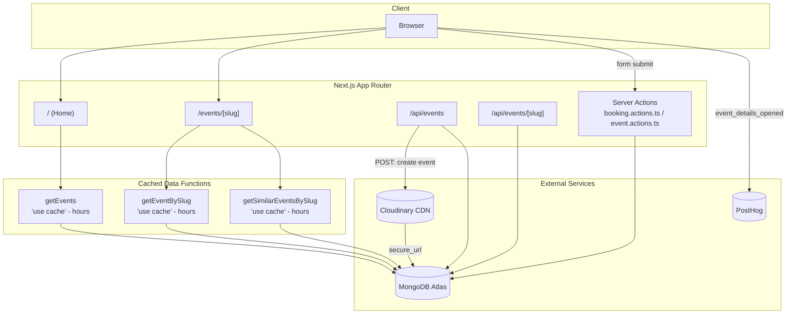

## Full-stack Event Management App (Next.js + TailwindCSS)

A full-stack event management starter built with Next.js 16, MongoDB, and Cloudinary. Browse, book, and discover developer events — hackathons, meetups, and conferences — all in one place.

If you're looking to build a functional full-stack event management app, or just want to learn more about Next.js, this is a solid starting point. The template includes a working home page for browsing existing events and a full event details page.


## Features

- Browse and search developer events with a responsive, accessible UI (WCAG 2.0 AA)
- Event detail pages with agenda, tags, organizer info, and similar-event recommendations
- Event registration via a booking form with duplicate-entry protection
- Image uploads handled through Cloudinary
- Server-side data caching (`use cache`) with per-function cache lifetimes
- Streaming UI via React Suspense with custom loading and not-found states
- PostHog analytics integration

## Stack

| Layer     | Technology                                           |
| --------- | ---------------------------------------------------- |
| Framework | Next.js 16 (App Router, Turbopack, Cache Components) |
| Language  | TypeScript                                           |
| Styling   | Tailwind CSS v4                                      |
| Database  | MongoDB via Mongoose                                 |
| Media     | Cloudinary                                           |
| Analytics | PostHog                                              |

## Architecture & Data Flow



**Flow summary:**

1. Server Components (`page.tsx`) call cached data functions directly against MongoDB — no internal HTTP round-trip.
2. `POST /api/events` uploads the event image to Cloudinary first, then persists the event (with the resulting `secure_url`) to MongoDB.
3. Bookings are created via a Server Action, validated against the `Event` collection, and protected by a unique `(eventId, email)` index.
4. Client interactions (event views) are tracked via PostHog.

## Data Models

- **Event** — title, slug (auto-generated), description, schedule, venue, agenda, tags, organizer
- **Booking** — references an `Event`, stores attendee email, enforces one booking per email per event

## Getting Started

```bash
git clone <repo-url>
cd event-management-app-next.js
npm install
```

Create `.env.local`:

```env
MONGODB_URI=mongodb+srv://...
CLOUDINARY_URL=cloudinary://<api_key>:<api_secret>@<cloud_name>
NEXT_PUBLIC_BASE_URL=http://localhost:3000
```

```bash
npm run dev
```

## Project Structure

```
app/
  page.tsx                 # Home - event listing
  events/[slug]/           # Event details, loading, not-found
  api/events/              # REST routes (POST with Cloudinary upload, GET)
  api/events/[slug]/       # GET by slug
components/                # EventCard, BookingForm, carousels, etc.
database/                  # Mongoose schemas (Event, Booking)
lib/
  actions/                 # Server Actions & cached data functions
  mongodb.ts                # Connection singleton
scripts/                   # Seed & one-off data-fix scripts
```

## Scripts

| Command                          | Description                         |
| -------------------------------- | ----------------------------------- |
| `npm run dev`                    | Start dev server (Turbopack)        |
| `npm run build`                  | Production build                    |
| `npm run start`                  | Start production server             |
| `npx tsx scripts/seed-events.ts` | Seed sample events (via Cloudinary) |

## License

MIT
